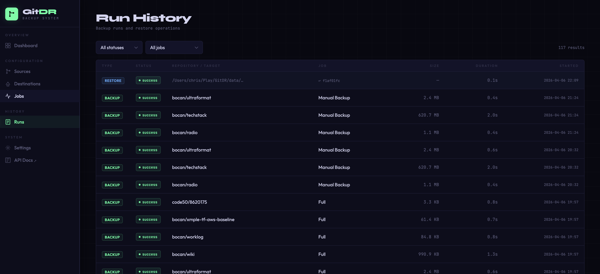
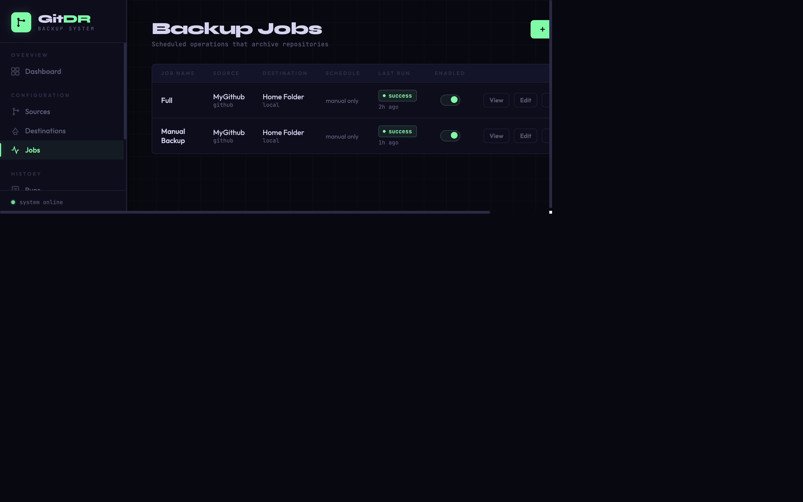
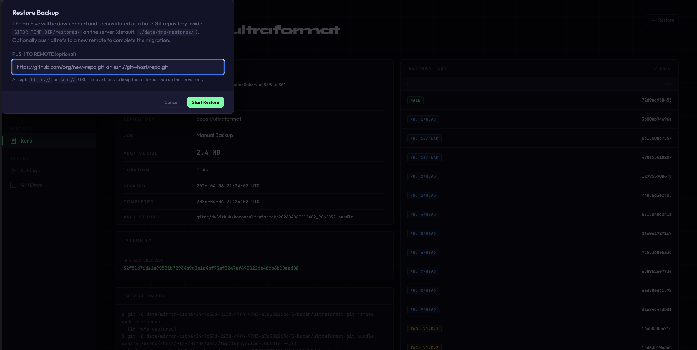

# GitDR — Git Disaster Recovery

> **Your code doesn't live at GitHub.  It just visits.**

GitDR is a self-hosted, encrypted Git backup and restore system. It continuously mirrors repositories from every major Git forge to storage you control — so when a provider goes down, goes dark, or locks your account, you can be back online in minutes, not weeks.

---

## The Risk Nobody Plans For

Every engineering organisation has a dependency they rarely think about: their Git hosting provider. GitHub, GitLab, Azure DevOps, and Bitbucket each handle hundreds of millions of repositories. They are also single points of failure.

When a major provider suffers an outage, a billing dispute, an acquisition, or a policy change, organisations that haven't planned for it face the same painful reality:

- No access to source code means no deployments, no hotfixes, no onboarding
- CI/CD pipelines go dark instantly
- The blast radius scales directly with how many repos you have and how long it takes to restore

GitDR solves this by ensuring you always have a current, verified, restorable copy of every repository under your control — stored wherever you choose.

---

## What GitDR Does

```
┌──────────────────────────────────────────────────────────────────────────┐
│  Your Git Forges                    GitDR                Your Storage    │
│                                                                          │
│  GitHub ──────────┐                                                      │
│  GitLab ──────────┤──► Discover ──► Mirror ──► Archive ──► │ S3 / Azure  │
│  Azure DevOps ────┤    Validate     Cache      Encrypt     │ GCS / Local │
│  Bitbucket ───────┘                                                      │
└──────────────────────────────────────────────────────────────────────────┘
                              │
                              ▼
                    Web UI + REST API
                    Monitor · Alert · Restore
```

**On a schedule you define**, GitDR:

1. Connects to your forges via API and discovers every repository automatically
2. Creates or updates an incremental mirror cache (only fetches deltas after the first run)
3. Produces a portable Git bundle — a complete, self-contained backup
4. Uploads it to a storage backend you control, with a deterministic key structure
5. Verifies the archive with a SHA-256 checksum before recording success
6. Enforces a retention policy, removing old backups beyond the count you specify
7. Records the full run log — every ref, every byte count — in an encrypted local database

---

## Screenshots

| Dashboard | Run History |
|---|---|
|  |  |

| Backup Job List | Run Detail + Restore |
|---|---|
|  |  |

---

## Key Features

### Multi-Forge, Multi-Destination

| Source Forges | Storage Destinations |
|---|---|
| GitHub (orgs + personal) | Amazon S3 (and S3-compatible stores) |
| GitLab (groups + subgroups) | Azure Blob Storage |
| Azure DevOps | Google Cloud Storage |
| Bitbucket | Local filesystem |
| Any generic Git server | |

Mix and match freely. Back up your GitHub org to S3 and your GitLab instance to Azure Blob in the same deployment. Add a local destination as a fast-access warm copy.

### Automatic Repository Discovery

There's no need to manually register repositories. GitDR queries forge APIs, paginates through all repos, and keeps a live cache. Your job configuration includes a checkbox picker with bulk select — just tick what you want backed up, or select all. New repositories that appear after initial setup are discoverable with a single click.

### Encrypted Everywhere

GitDR encrypts credentials at two levels:

- **Field-level encryption** — API tokens, SSH keys, and passwords are encrypted with Fernet (AES-128 in CBC mode, HMAC-SHA256) before being written to the database
- **Database encryption** — The entire SQLite database is encrypted at rest using SQLCipher (AES-256)
- **Master passphrase** — Everything derives from a single `GITDR_DB_PASSPHRASE` environment variable, which never appears in logs, health checks, or API responses

### Incremental Backups

GitDR maintains a local mirror cache (`git clone --mirror`). After the initial full clone, subsequent backup runs only transfer the delta — the refs and objects that changed. For large repositories with thousands of commits and branches, this makes scheduled backups fast and cheap.

### Two Portable Archive Formats

| Format | Best For |
|---|---|
| **Git bundle** | Standard git restore via `git clone`. Maximum portability. Works anywhere git is installed. |
| **tar + zstd** | Complete bare repository including hooks, config, and non-standard files. Larger but more thorough. |

Both formats are fully self-contained and can be restored independently of GitDR.

### Verified Backups

Every archive is checksummed with SHA-256 before the run is marked successful. The checksum is stored alongside the archive metadata. Restore operations verify the checksum before extraction — you don't find out a backup was corrupt when you need it most.

### Scheduled and On-Demand

- Cron-based schedules configured per job (e.g. every night at 02:00, every 6 hours)
- Manual trigger available from the web UI or REST API at any time
- APScheduler runs in-process — no separate worker, no Redis, no Celery

### Restore Workflow

When you need to recover:

1. Open the run detail page for any successful backup
2. Click **Restore** — optionally provide a target remote URL (`https://` or `ssh://`)
3. GitDR downloads the archive, verifies the checksum, and reconstitutes the repository
4. If a push URL is given, all refs are pushed to the new remote and the local copy is cleaned up
5. Every restore attempt is tracked — status, log output, and destination — with live polling in the UI

Restores appear in Run History alongside backups so nothing is invisible.

### Retention Enforcement

Configure how many backup copies to keep per repository per job. GitDR automatically removes archives beyond the retention count from the storage backend after each successful run.

### Full Web UI — No CLI Required

GitDR ships a complete, dark-themed web interface:

- **Dashboard** — live summary of sources, repos, jobs, success rate, storage used, recent activity
- **Run History** — combined table of backup and restore operations with status, size, duration, filtering
- **Run Detail** — every ref backed up, archive format, checksum, error log, restore trigger
- **Source Management** — add forges, test credentials before saving, view cached repos
- **Job Configuration** — set schedule, choose repos via checkbox picker, select destination
- **Settings** — cache statistics, bulk clear, system info

HTMX-powered interactivity: live polling of active runs, inline editing, toast notifications — no JavaScript build step, no SPA.

### REST API Included

Every operation available in the UI is also available via the REST API (`/api/v1/`). Auto-generated OpenAPI documentation at `/docs`. Useful for integrating GitDR into your existing tooling, CI/CD pipelines, or incident response runbooks.

---

## Why GitDR for Disaster Recovery?

### Recovery Time Objective

The limiting factor in recovering from a forge outage is how quickly you can get a working repository into a new location. With verified, current archives on storage you control, RTO is measured in minutes-to-hours rather than days-to-never.

| Scenario | Without GitDR | With GitDR |
|---|---|---|
| Provider outage (temporary) | Wait and hope | Continue working from local mirror cache |
| Account suspended / billing dispute | No access to code | Restore all repos to a new provider in hours |
| Provider acquires / shuts down service | Data loss risk | Full archive already in your S3 / Azure / GCS |
| Accidental force-push or branch deletion | Limited to provider's own retention | Restore from the last verified backup |
| Ransomware on your forge-connected systems | Repos potentially compromised | Clean archive preserved offline |

### Recovery Point Objective

RPO is directly controlled by your backup schedule. Nightly backups give you 24-hour RPO. Hourly schedules give you sub-hour RPO. The incremental mirror cache makes frequent schedules cheap.

### No Vendor Lock-in

Archives are standard Git bundles. You can restore them with just `git`. GitDR is a convenience layer, not a dependency — if GitDR itself were unavailable, you could restore from the raw archives manually.

### Regulatory and Compliance Value

Many compliance frameworks (SOC 2, ISO 27001, FedRAMP) require documented data backup and recovery procedures for critical systems. Source code is a critical system. GitDR provides:

- Auditable run history with timestamps, checksums, and logs
- Encrypted storage of credentials and backup metadata
- Configurable retention policies
- Documented restore procedure with live verification

---

## Getting Started

### Prerequisites

- Docker and Docker Compose
- An S3 bucket, Azure Blob container, GCS bucket, or local path to store archives
- API tokens for the forges you want to back up
- A strong master passphrase

### Quick Start

```bash
# 1. Clone the repo
git clone https://github.com/bocan/GitDR.git
cd GitDR

# 2. Set your master passphrase
echo "GITDR_DB_PASSPHRASE=your-strong-passphrase-here" > .env

# 3. Start
docker compose up -d

# 4. Open the UI
open http://localhost:8420
```

The UI walks you through the rest: add a source (paste your API token — it's encrypted before saving), configure a destination, create a job, and trigger your first backup.

### Docker Compose Reference

```yaml
services:
  gitdr:
    image: gitdr:latest        # or build: . for local builds
    ports:
      - "8420:8420"
    volumes:
      - gitdr-data:/app/data
      # Mount a local backup destination (if using local storage backend)
      # - /your/backup/path:/backups
      # Access restored repositories from the host machine
      # - /your/restore/path:/app/data/tmp/restores
    environment:
      - GITDR_DB_PASSPHRASE=${GITDR_DB_PASSPHRASE}
    restart: unless-stopped

volumes:
  gitdr-data:
```

### Environment Variables

| Variable | Default | Description |
|---|---|---|
| `GITDR_DB_PASSPHRASE` | *(required)* | Master passphrase — never expose this |
| `GITDR_DB_PATH` | `./data/gitdr.db` | SQLCipher database file path |
| `GITDR_CACHE_DIR` | `./data/mirror-cache` | Local mirror cache directory |
| `GITDR_TEMP_DIR` | `./data/tmp` | Temporary directory for archive creation and restores |
| `GITDR_HOST` | `0.0.0.0` | Bind address |
| `GITDR_PORT` | `8420` | Bind port |
| `GITDR_LOG_LEVEL` | `INFO` | Logging verbosity |

---

## Deployment Recommendations

### Place It Behind a Reverse Proxy

GitDR has no built-in authentication in its current form — it is designed for deployment on a trusted internal network or behind an authenticating reverse proxy (nginx, Caddy, Traefik with basic auth or SSO). Do **not** expose port 8420 directly to the internet.

### Persist the Data Volume

The `gitdr-data` volume contains the encrypted database, the mirror cache, and temporary restore directories. Back this up independently — losing it means losing run history and the mirror cache (though archives on your storage backend are unaffected).

### Run a Second Destination

For genuine DR, archive to at least two separate destinations in separate regions or providers. If your primary S3 bucket is in `us-east-1`, add a second job archiving to `eu-west-1`, or to Azure Blob. GitDR supports multiple destinations per deployment.

### Test Your Restores

A backup you have never restored is a backup you don't trust. Use GitDR's restore workflow periodically — pick a non-critical repo, restore it to a scratch remote, confirm the history is intact. The restore log records every step and the UI shows the result permanently.

---

## Architecture in 90 Seconds

```
┌─────────────────────────────────────────────────────────┐
│                    Docker Container                     │
│                                                         │
│  FastAPI (Uvicorn, single worker)                       │
│  ├── Web UI (Jinja2 + HTMX)                             │
│  ├── REST API  /api/v1/                                 │
│  └── APScheduler (in-process, async)                    │
│                                                         │
│  Services                                               │
│  ├── backup.py       Orchestration                      │
│  ├── restore.py      Download → verify → reconstitute   │
│  ├── git_ops.py      subprocess wrappers (no shell=True)│
│  ├── discovery.py    Forge API clients, repo cache      │
│  ├── retention.py    Enforce keep-N policy              │
│  └── storage/        local · s3 · azure_blob · gcs      │
│                                                         │
│  Database: SQLCipher (AES-256)                          │
│  ├── Credentials encrypted at field level (Fernet)      │
│  └── Auto-migrated on startup                           │
└─────────────────────────────────────────────────────────┘
```

Single container. No external dependencies. Runs on a $5 VPS or in a Kubernetes pod.

---

## Security Notes

- API tokens are encrypted before being written to disk — even with full database access, credentials are not recoverable without the master passphrase
- All `git` subprocess calls use argument lists, never `shell=True`, preventing command injection
- Clone URLs are validated to use `https://` or `ssh://` — plain HTTP is rejected
- The master passphrase never appears in logs, health check responses, or environment listings
- S3/Azure/GCS SDK connections enforce TLS by default; custom endpoint URLs are validated for `https://`

---

## Contributing

Issues and pull requests welcome. Run the test suite with:

```bash
make test        # Full suite with coverage (295 tests)
make lint        # ruff
make type-check  # mypy
make format      # ruff format
```

---

## Status

GitDR is production-ready for single-organisation deployments on trusted networks. It is actively developed. See [SPEC.md](SPEC.md) for the full technical specification and roadmap.

---

*Built for the engineers who remember that "the cloud" is just someone else's computer — and plan accordingly.*
